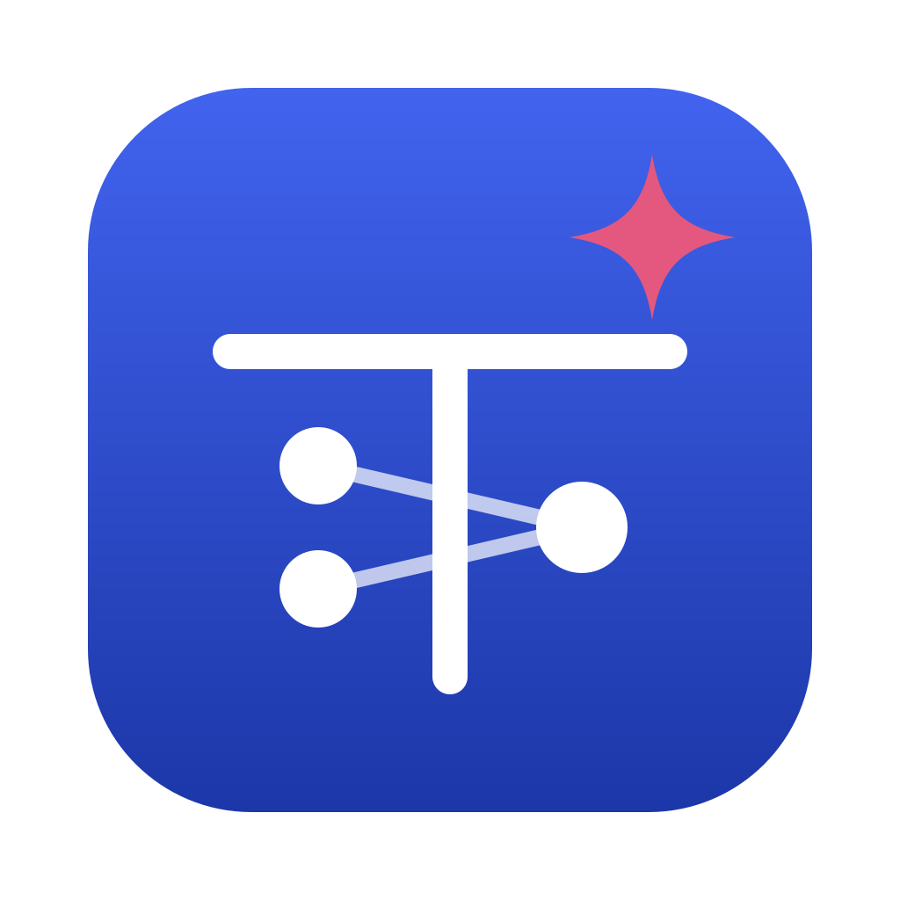

<p align="center"></p>

<h1 align="center">Saldo</h1>

<p align="center">Das Buchungsmodell von <a href="https://kontobuch.johannesgrof.me">Kontobuch</a>, dem digitalen Heft für Rechnungswesen an HAK und HTL.</p>

---

Saldo ist ein kleines Sprachmodell. Es bucht einen Geschäftsfall so, wie es österreichische Schulbücher erwarten, im Einheitskontenrahmen (EKR). Vorher nennt es die Fallart, zu der Kontobuch einen Merksatz zeigt. Saldo läuft nur auf dem eigenen Gerät, ohne Internet und ohne Cloud. Es kommt nur bei den Fällen dazu, bei denen sich die Regeln von Kontobuch nicht sicher sind.

Ein Beispiel:

```
Fall:     S 155 · Gutschrift vom Lieferanten Lavanttal Großhandels-GmbH (33244) für einen
          nachträglich gewährten Preisnachlass € 700,– + € 140,– USt = € 840,–
Saldo:    Fallart: Gutschrift vom Lieferanten
          S 33244 840,00 | H 5000 700,00 | H 2500 140,00
```

## Auf einen Blick

| | |
|---|---|
| Neue Fälle richtig, in der App | **95,5 %**, keiner falsch angezeigt (Regeln allein 64,0 %) |
| Echte Übungsfälle aus HTL I und II | **67 von 69** richtig, keiner falsch angezeigt |
| Fallart richtig erkannt | 99,8 % |
| Zeit pro Buchung | 0,26 s am Mac (GPU), auf Windows und Linux etwas länger (CPU) |
| Größe | 639 MB (GGUF, Q8_0) |
| Grundlage | [Qwen3-0.6B](https://huggingface.co/Qwen/Qwen3-0.6B) von Qwen (Alibaba Cloud), Apache 2.0 |

## Download

Saldo ist **nicht Teil der Installation** von Kontobuch. Es wird einmal extra geladen, nur wenn du zustimmst.

**Normalerweise in der App:**
1. Kontobuch für Mac, Windows oder Linux laden: **https://kontobuch.johannesgrof.me**
2. Saldo installieren. Das geht auf einem dieser Wege:
   - im Fenster „Saldo ist da!“ nach dem ersten Start
   - unter **Einstellungen → Saldo**
   - unter Windows schon im Installer, der fragt: „Saldo mitinstallieren?“
3. Kontobuch lädt die Datei im Hintergrund und prüft ihre SHA-256-Prüfsumme. Du kannst währenddessen weiterarbeiten. Neue Versionen von Saldo bietet die App selbst an. Entfernen kannst du Saldo jederzeit in den Einstellungen.

Die Web-App hat Saldo nicht, nur die Desktop-App.

**Von Hand**, etwa für Schulrechner ohne Internet:
1. Die Datei `saldo-<version>-q8_0.gguf` vom neuesten [Release](https://github.com/jx-grxf/kontobuch-saldo/releases/latest) laden und die Prüfsumme kontrollieren. Sie steht bei jedem Release.

   ```sh
   shasum -a 256 saldo-v0.1.0-q8_0.gguf                         # macOS
   sha256sum saldo-v0.1.0-q8_0.gguf                             # Linux
   Get-FileHash .\saldo-v0.1.0-q8_0.gguf -Algorithm SHA256      # Windows (PowerShell)
   ```

2. Die Datei als `kontobuch-booking.gguf` in den Datenordner von Kontobuch legen:

   | System | Ordner |
   |---|---|
   | macOS | `~/Library/Application Support/me.johannesgrof.kontobuch/` |
   | Windows | `%APPDATA%\me.johannesgrof.kontobuch\` |
   | Linux | `~/.local/share/me.johannesgrof.kontobuch/` |

3. Kontobuch neu starten. Unter **Einstellungen → Saldo** steht dann „Installiert“.

## So arbeitet Saldo in Kontobuch

```
Foto / PDF / Text → Texterkennung → Fälle, Belege, Tabellen
                  → Regeln von Kontobuch
                       sicher? ──ja──→ damit wird geprüft
                       nein ↓
                  → Saldo: Fallart und Buchungssatz
                  → dieselbe Prüfung wie für die eigenen Lösungen
                       bestanden? ──ja──→ „Vorschlag von Saldo“, Haken bei gleicher Buchung
                       nein ──→ „nicht sicher prüfbar“, nie „falsch“
```

- **Saldo rechnet keine Beträge aus.** Kontobuch legt ihm jeden Betrag vor, den ein Fall brauchen kann: gedruckte Beträge, Netto, Steuer und Brutto, Rabatt und Skonto in Stufen, offene Belege abzüglich Gutschriften. Saldo wählt nur Konten, Seiten und welcher Betrag wohin gehört. Eine Grammatik lässt nur diese Beträge und bekannte Konten zu.
- **Saldo urteilt nie allein.** Jede Antwort muss aufgehen und jeden Betrag des Falls buchen. Sie muss eine genannte Steuer, ein genanntes Konto und das Personenkonto enthalten und zum Wörterbuch der Regeln passen. Was durchfällt, wird verworfen.
- **Bestätigt, aber verurteilt nie.** Stimmt die Buchung eines Schülers mit Saldo überein, gibt es den Haken. Weicht sie ab, kommt ein Hinweis, aber nie „falsch“. Eine falsche Antwort von Saldo kann deshalb keine richtige Buchung schlechtmachen.
- **Nur auf dem Gerät.** Kein Fall und kein Foto verlässt den Computer.

## Benchmarks

Gemessen nur auf Fällen, die Saldo nie gesehen hat. *Richtig* heißt: Jedes Konto endet mit dem richtigen Betrag auf der richtigen Seite.

<!-- benchmark:start -->
**Neue Fälle** (400, mit Firmen, Personen, Waren und Formulierungen, die im Training nicht vorkamen)

| Weg | richtig | falsch | keine Antwort | Genauigkeit | |
|---|---:|---:|---:|---:|---|
| Regeln allein | 256 | 0 | 144 | **64,0 %** | `█████████████░░░░░░░` |
| Saldo allein | 384 | 13 | 3 | **96,0 %** | `███████████████████░` |
| Regeln + Saldo | 397 | 1 | 2 | **99,2 %** | `████████████████████` |
| **In der App** (Saldo geprüft) | 382 | 0 | 18 | **95,5 %** | `███████████████████░` |

**Echte Übungsfälle** (69, aus *Unternehmensrechnung HTL I* und *HTL II*, nie trainiert)

| Weg | richtig | falsch | keine Antwort | Genauigkeit | |
|---|---:|---:|---:|---:|---|
| Regeln allein | 57 | 0 | 12 | **82,6 %** | `█████████████████░░░` |
| Saldo allein | 52 | 14 | 3 | **75,4 %** | `███████████████░░░░░` |
| Regeln + Saldo | 67 | 2 | 0 | **97,1 %** | `███████████████████░` |
| **In der App** (Saldo geprüft) | 67 | 0 | 2 | **97,1 %** | `███████████████████░` |

**Verlauf** (Saldo allein / Regeln + Saldo)

| Lauf | neue Fälle | Buchfälle | gemessen an |
|---|---:|---:|---|
| v5 | 96,0 % / 99,2 % | 75,4 % / 97,1 % | 400 neuen, 69 Buchfällen |
| v4 | 61,0 % / 76,8 % | 66,7 % / 85,5 % | 400 neuen, 69 Buchfällen |
| v3 | 88,5 % / 99,0 % | 72,5 % / 100,0 % | 200 neuen, 40 Buchfällen |
| v2 | 87,8 % / 95,6 % | 67,5 % / 100,0 % | 2000 neuen, 40 Buchfällen |

v4 und v5 wurden auf demselben Testsatz mit 44 Fallarten gemessen; 16 davon kannte v4 noch nicht. v2 und v3 wurden auf einem älteren, leichteren mit weniger Fallarten gemessen. Vergleichbar sind nur Zeilen mit gleichem Testsatz.

*In der App* ist, was ein Schüler sieht: Regeln, wo sie sicher sind, sonst Saldo, aber nur mit Antworten, die die Prüfung der App bestehen. Deshalb steht dort bei *falsch* eine 0.
<!-- benchmark:end -->

Alle Messungen, auch nach Fallart und Übung: **[BENCHMARKS.md](BENCHMARKS.md)**.

## Modellkarte

| | |
|---|---|
| Basismodell | [Qwen3-0.6B](https://huggingface.co/Qwen/Qwen3-0.6B) (Qwen, Alibaba Cloud), Apache 2.0, nur Text |
| Feinabstimmung | LoRA, Rang 16, alle Schichten, etwa 10 Mio. trainierbare Parameter (1,7 %), in das Basismodell eingerechnet |
| Training | 2500 Schritte zu je 8 Fällen, [MLX](https://github.com/ml-explore/mlx) / [mlx-lm](https://github.com/ml-explore/mlx-lm) auf einem MacBook Pro M5 Pro |
| Trainingsdaten | 40 000 selbst geschriebene Übungsfälle in 44 Fallarten, nur eigene Vorlagen |
| Format | GGUF, Q8_0, für [llama.cpp](https://github.com/ggml-org/llama.cpp) |
| Ausgabe | zwei Zeilen: `Fallart: Wareneinkauf`, dann `S 5000 5.436,00 \| S 2500 1.087,20 \| H 33016 6.523,20` |
| Sprache | Deutsch mit österreichischen Fachbegriffen |
| Umfang | Einzelbuchungen auf dem Niveau HTL I und II in 44 Fallarten, zum Beispiel: Ein- und Verkauf, Zahlungen, Rabatt und Skonto, Gutschriften, Bezugs- und Ausgangsfracht, Aufwände, Anlagen samt Abschreibung, Verkauf und Inzahlungnahme, Anlagen in Bau, Eigenleistung, Privat, Umsatzsteuer, Bestandsveränderung, Rückstellung, Forderungsausfall und Einzelwertberichtigung, Gehalt und Dienstgeberabgaben, Reisekosten, Kartenabrechnung, Darlehen, ig. Erwerb, Einfuhr, Ausfuhr |
| Nicht im Umfang | Fremdwährung, Kostenrechnung, mehrere Schritte in einem Satz |
| Gedacht für | Kontobuch, das die Eingabe baut: Fall, Beleg, die Liste der möglichen Beträge und die offenen Belege. Ohne diese Liste und ohne die Prüfung danach ist Saldo nicht gedacht. |

### Daten und Urheberrecht

- **Trainiert wird nur auf eigenen Vorlagen.** Firmen, Personen, Waren und Beträge sind erfunden. Die Formulierungen folgen den Mustern, die Schulbücher verwenden („+ 20 % USt“, „inkl. 20 % USt“), also allgemeiner Fachsprache. Buchungsregeln und der Einheitskontenrahmen sind Tatsachen.
- **Schulbücher dienen nur zum Messen.** Die Übungsfälle aus *Unternehmensrechnung HTL I* und *HTL II* bleiben auf dem Rechner, auf dem gemessen wird. Sie werden nie veröffentlicht und nie trainiert, sonst wären sie als Test wertlos.
- **Gemessen wird auf Unbekanntem.** Jede Liste von Firmen, Personen, Waren und Formulierungen ist geteilt. Die Testfälle verwenden nur den Teil, den Saldo nie gesehen hat.

## Versionen

Saldo hat eigene Versionen, getrennt von denen der App.

| Version | Datum | Trainingslauf | Neue Fälle (in der App) | Buchfälle (in der App) | Datei |
|---|---|---|---:|---:|---|
| [0.1.0](https://github.com/jx-grxf/kontobuch-saldo/releases/tag/saldo-v0.1.0) | 2026-10-05 | v5 | 95,5 % | 67 / 69 | 639 MB |

Was sich geändert hat, steht in [CHANGELOG.md](CHANGELOG.md).

## Credits

Saldo steht auf den Schultern von:

- **[Qwen3-0.6B](https://huggingface.co/Qwen/Qwen3-0.6B)** vom Qwen-Team (Alibaba Cloud). Es ist das Basismodell, auf dem Saldo trainiert ist. Lizenz Apache 2.0.
- **[MLX](https://github.com/ml-explore/mlx)** und **[mlx-lm](https://github.com/ml-explore/mlx-lm)** von Apple, für das LoRA-Training auf Apple Silicon. Lizenz MIT.
- **[llama.cpp](https://github.com/ggml-org/llama.cpp)** und **ggml**, für die Umwandlung nach GGUF und als Laufzeit in Kontobuch auf Mac, Windows und Linux. Lizenz MIT.
- **[llama-cpp-2](https://github.com/utilityai/llama-cpp-rs)**, die Rust-Anbindung an llama.cpp in der App. Lizenz MIT / Apache 2.0.

```bibtex
@misc{qwen3technicalreport,
  title  = {Qwen3 Technical Report},
  author = {Qwen Team},
  year   = {2025},
  eprint = {2505.09388},
  archivePrefix = {arXiv},
  url    = {https://arxiv.org/abs/2505.09388}
}
```

## Lizenz

Die Modelldateien von Saldo stehen wie Qwen3-0.6B unter der **[Apache License 2.0](LICENSE)**. Wer sie weitergibt, gibt [NOTICE](NOTICE) mit.

Kontobuch selbst, die App, ist nicht Open Source. Dieses Repository enthält nur das Modell, seine Beschreibung und seine Messungen.
